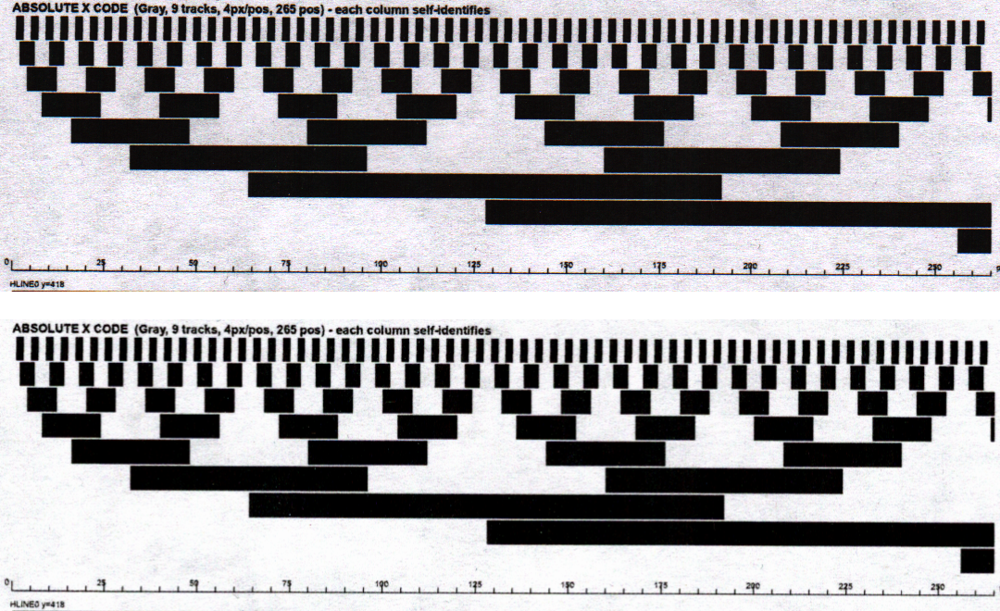
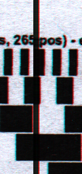
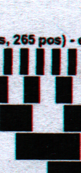
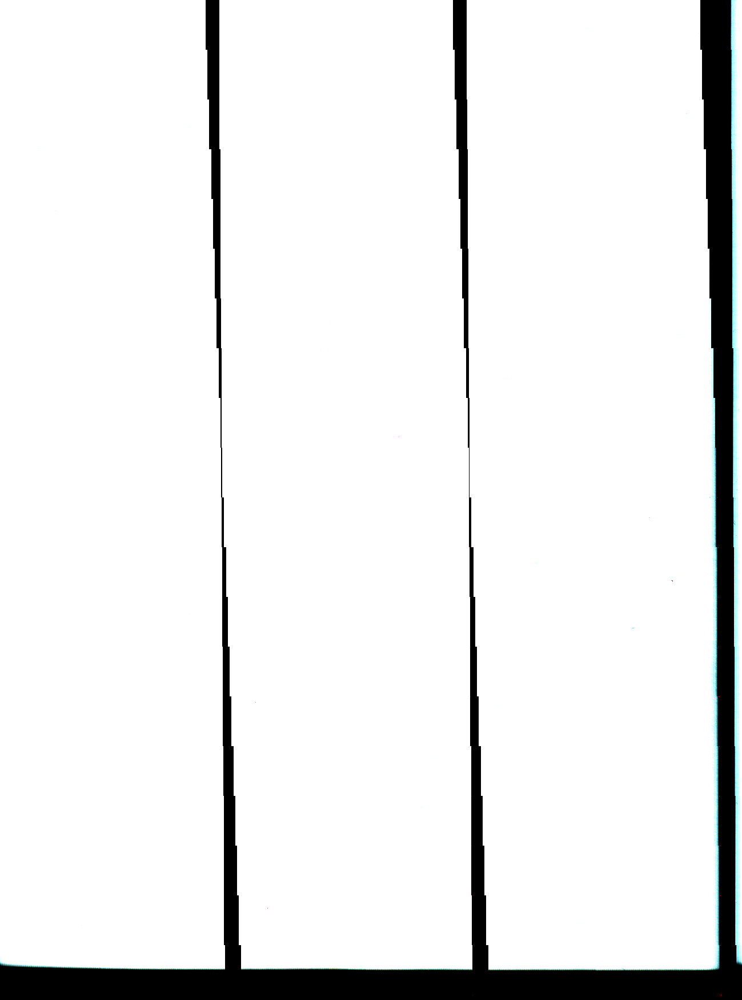
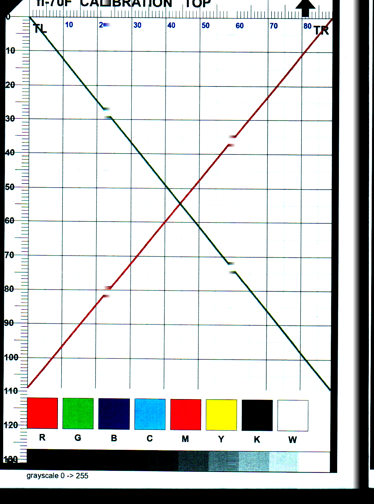

# sane-fi70f — Ricoh/Fujitsu fi-70F support for the SANE `epjitsu` backend

Work-in-progress support for the **Ricoh/Fujitsu fi-70F** flatbed scanner (USB `05ca:0308`) in
the SANE `epjitsu` backend. This repository holds our patch, the full modified backend, the
reverse-engineering write-up, and proof images.

This is a **full, gap-free, correctly-calibrated colour scan of the fi-70F on Linux**, verified
numerically against the Windows PaperStream output. Read path, descramble geometry, and the
calibration operating point are all solved and hardware-verified; the only remaining difference
from Windows is the output tone curve (gamma), which SANE leaves user-adjustable.

Upstream tracking issue: **[sane-project/backends#833](https://gitlab.com/sane-project/backends/-/issues/833)**

## Status

| Area | State |
|---|---|
| Firmware upload, detection | ✅ works |
| Full-page scan (read path) | ✅ works — free-running page, strip the 8-byte per-block trailer |
| Resolutions | ✅ **300 and 600 dpi** (native optical), both descramble-verified |
| Descramble geometry | ✅ **solved, gap-free** at both resolutions — 3 byte-interleaved heads per plane, tiled → 1240 px (300 dpi) / 2480 px (600 dpi); encoder ramp **264–265/265 positions, 0 jumps** |
| Seam handling | ✅ heads tile continuously — **no dead pixels, no interpolation** |
| Coarse (analog) calibration | ✅ Windows' converged per-channel operating point (offset 22/23/21, gain 37/35/34) |
| Per-channel colour cast | ✅ **fixed** — neutral wedge, max channel deviation ~7.6 (was ~70) |
| Output tone / gamma | ⬜ more linear than PaperStream's baked contrast curve (SANE-appropriate; user-adjustable) |
| B&W camera-back (`--mode Sub-exposures`) | 🟡 foundation — lamp-off, 16-bit lossless 3-sub-exposure output; Y-dither measured (G −0.245 / B −0.723 px @300); HDR + Y-super-res in progress |

See **[FINDINGS.md](FINDINGS.md)** for the full technical story: the 8-byte block trailer (read
path), the self-decoding Gray-code target used as the oracle, the true 3×432 head geometry, and
Windows' coarse operating point.

## Verified vs Windows (fresh Linux scan of a self-decoding target)

| metric | old build | this build | Windows |
|---|---|---|---|
| encoder ramp | ~2 seam gaps | **265/265, 0 jumps** | 265/265 |
| neutral-wedge max channel deviation | ~70 (cyan) | **7.6** | ~3 |
| white uniformity (σ across columns) | — | **3.1** (flat) | 6.9 |

Ours (left) vs Windows PaperStream (right), row-aligned:


Encoder tracks run gap-free full width across both head seams (ours top / Windows bottom):



## 600 dpi

The second native resolution (2480×3496) works the same way at ~2× scale — see
[FINDINGS.md](FINDINGS.md#600-dpi) for the geometry. Verified **265/265 encoder positions, 0 jumps**.


The head seams needed one extra fix at 600 dpi: switching heads too early landed on a head's dark,
vignetted far edge, producing a black seam at ⅓ width. Switching at the outgoing head's inner edge
(plus a 2-column edge blend) removes it — left seam, before vs after:

| Before (black seam) | After (fixed) |
|---|---|
|  |  |

## What's here

- `backend/epjitsu.c`, `backend/epjitsu-cmd.h`, `backend/epjitsu.h`, `backend/epjitsu.conf.in` —
  the full modified backend (against `sane-project/backends` @ `ca8d120`). The fi-70F coarse/fine
  cal tables live in `epjitsu-cmd.h`.
- `fi70f-epjitsu.patch` — the diff only, for applying onto an upstream checkout.
- `images/` — proof: read-path drift symptom vs geometry fixed, colour before/after, and the final
  gap-free / neutral-wedge comparison against the Windows golden.

## Build & use

```sh
git clone https://gitlab.com/sane-project/backends.git
cd backends
git checkout ca8d120
git apply /path/to/fi70f-epjitsu.patch      # or copy backend/epjitsu.{c,h} over
./configure && make -C backend libepjitsu_la-epjitsu.lo && make && sudo make install
```

Extract the firmware `Comp70fFirmFile` (an `NDL1` blob) from the PaperStream IP package, rename it
`70f_0000.nal` (or `70f_0A00.nal` to match your firmware revision), drop it in the epjitsu firmware
dir, and add to `epjitsu.conf`:

```
firmware /usr/share/sane/epjitsu/70f_0000.nal
usb 0x05ca 0x0308
```

Then `scanimage -d "epjitsu:libusb:BBB:DDD" --mode Color --resolution 300 --format=pnm > scan.pnm`.

## Before / after

The apparent per-block "drift" (3 jagged dark seam bars marching across the page) was entirely the
un-stripped 8-byte block trailer. Strip it and the seams stand still:

| Drift symptom (trailer left in) | Geometry fixed (trailer stripped) |
|---|---|
|  |  |

## Credits

Reverse-engineered by **Devin Cooper**; complementary to **@tete17**'s `0A00`-firmware work on
issue #833. All findings verified on real hardware. Not affiliated with or endorsed by
Ricoh/Fujitsu or the SANE project.
